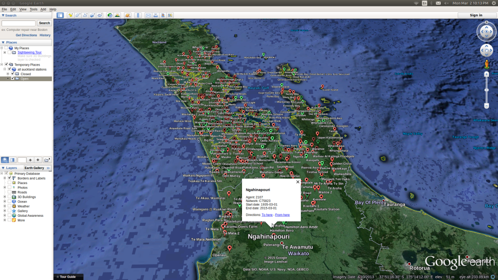
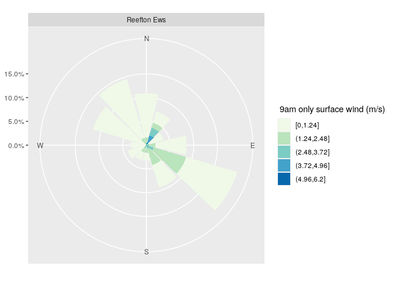
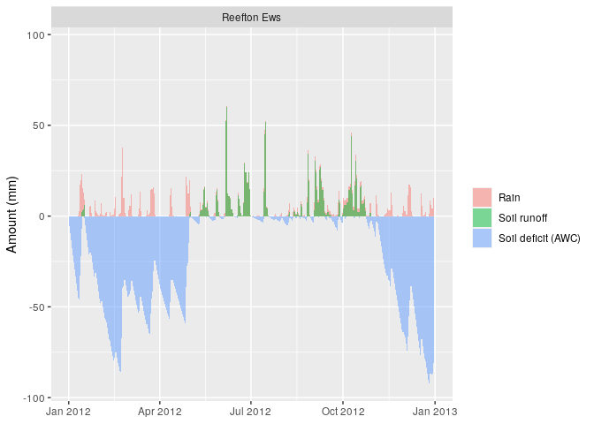

<!-- README.md is generated from README.Rmd. Please edit that file -->
Enhancing the National Climate Database with *clifro*
=====================================================

[](https://travis-ci.org/ropensci/clifro) [](https://cran.r-project.org/package=clifro) [](https://cran.r-project.org/package=clifro) [](https://codecov.io/github/ropensci/clifro?branch=master)

New Zealand's National Climate Database, CliFlo [CliFlo](http://cliflo.niwa.co.nz/) holds data from about 6500 climate stations, with observations dating back to 1850. CliFlo returns raw data at ten minute, hourly, and daily frequencies. CliFlo also returns statistical summaries, inclusive of about eighty different types of monthly and annual statistics and six types of thirty−year normals.

The *clifro* package is designed to minimise the hassle in downloading data from CliFlo. It does this by providing functions for the user to log in, easily choose the appropriate datatypes and stations, and then query the database. Once the data have been downloaded, they are stored as specific objects in **R** with the primary aim to ensure data visualisation and exploration is done with minimal effort and maximum efficiency.

This package extends the functionality of [CliFlo](http://cliflo.niwa.co.nz/) by returning stations resulting from simultaneous searches, the ability to visualise where these climate stations are by exporting to KML files, and elegant plotting of the climate data. The vignettes and help files are written with the intention that even inexperienced R users can use *clifro* easily. Exporting the climate data from **R** is fairly easy and for more experienced useRs, automated updating of spreadsheets or databases can be made much easier.

Free CliFlo Subscription
------------------------

A current [CliFlo subscription](http://cliflo.niwa.co.nz/pls/niwp/wsubform.intro) is recommended for *clifro*, otherwise data from only one station is available. The subscription is free and lasts for 2 years or 2,000,000 rows without renewal, which enables access to around 6,500 climate stations around New Zealand and the Pacific.

Note this package requires internet access for connecting to the National Climate Database web portal.

Installation in R
=================

``` r
# Install the latest CRAN release
install.packages("clifro")

# Or the latest development version
if(!require(devtools))
  install.packages("devtools")
devtools::install_github("ropensci/clifro")

# Then load the package
library(clifro)
```

Getting Started
===============

The following small example shows some of the core functionality in *clifro*.

Where are the climate stations?
-------------------------------

We can search for climate stations anywhere in New Zealand and return the station information in the form of a KML file. For example, we can return all the climate stations (current and historic) in the greater Auckland region.

``` r
all.auckland.st = cf_find_station("Auckland", search = "region", status = "all")
cf_save_kml(all.auckland.st, "all_auckland_stations")
```



Note the open stations have green markers and the closed stations have red markers.

Download and visualise public climate data
------------------------------------------

The only station available for unlimited public access to climate data is the Reefton electronic weather station (EWS). We can download the 2014 wind and rain data and easily visualise the results very easily.

``` r
public.cfuser = cf_user()

# Choose the datatypes
daily.wind.rain.dt = cf_datatype(c(2, 3), c(1, 1), list(4, 1), c(1, NA))

# Choose the Reefton EWS station
reefton.st = cf_station()

# Send the query to CliFlo and retrieve the data
daily.datalist = cf_query(user = public.cfuser, 
                          datatype = daily.wind.rain.dt, 
                          station = reefton.st,
                          start_date = "2012-01-01 00",
                          end_date = "2013-01-01 00")
#> connecting to CliFlo...
#> reading data...
#> UserName is = public
#> Number of charged rows output = 0
#> Number of free rows output = 732
#> Total number of rows output = 732
#> Copyright NIWA 2017 Subject to NIWA's Terms and Conditions
#> See: http://cliflo.niwa.co.nz/pls/niwp/doc/terms.html
#> Comments to: cliflo@niwa.co.nz

# Have a look at what data is now available
daily.datalist
#> List containing clifro data frames:
#>               data      type              start                end rows
#> df 1) Surface Wind  9am only (2012-01-01  9:00) (2012-12-31  9:00)  366
#> df 2)         Rain     Daily (2012-01-01  9:00) (2012-12-31  9:00)  366

# Plot the data using default plotting methods
plot(daily.datalist)     # For the first dataframe  (Surface Wind)
```



``` r
plot(daily.datalist, 2)  # For the second dataframe (Rain)
```



For more details and reproducible examples, see the [technical report](http://stattech.wordpress.fos.auckland.ac.nz/2015-02-new-zealands-climate-data-in-r-an-introduction-to-clifro/) for how to use *clifro*, including choosing datatypes, stations, saving locations as KML files and easy, elegant plotting for various different climate and weather data.

``` r
# View the clifro demo
demo(clifro)

# Read the 'Introduction to clifro' vignette
vignette("clifro")
```

Contributor Code of Conduct
===========================

The *clifro* package is released with a [contributor code of conduct](./CONDUCT.md). By participating in this project you agree to abide by its terms.

Citation
========

``` bibtex

To cite package ‘clifro’ in publications use:

Seers B and Shears N (2015). “New Zealand's Climate Data in R - An Introduction to clifro.” The University of Auckland, Auckland, New
Zealand. <URL: http://stattech.wordpress.fos.auckland.ac.nz/2015-02-new-zealands-climate-data-in-r-an-introduction-to-clifro/>.

A BibTeX entry for LaTeX users is

  @TechReport{,
    title = {New Zealand's Climate Data in R --- An Introduction to clifro},
    author = {Blake Seers and Nick Shears},
    institution = {The University of Auckland},
    address = {Auckland, New Zealand},
    year = {2015},
    url = {http://stattech.wordpress.fos.auckland.ac.nz/2015-02-new-zealands-climate-data-in-r-an-introduction-to-clifro/},
  }
```

[](http://ropensci.org)
